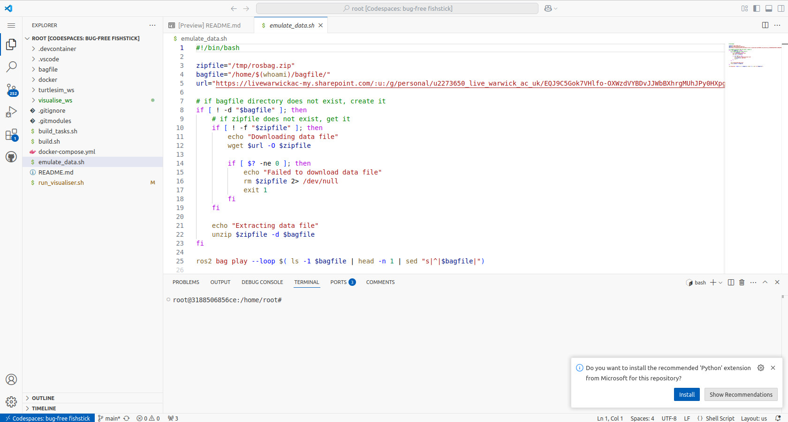
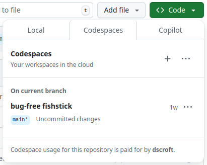
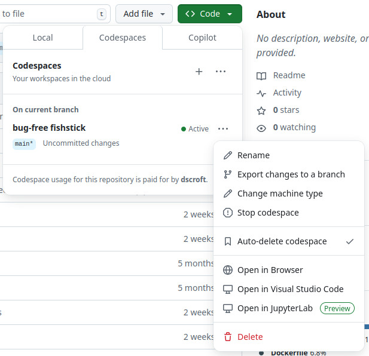

[Back to README.md](../README.md)

# GitHub Codespaces

It is possible run a ROS2 workspace via a variety of different methods.

Unlike ROS1, ROS2 has decided to take a Linux only approach.

- It is possible to run ROS2 on non-Linux systems via virtual machines, docker container or WSL2.

For this activity we will be running ROS2 in a docker container via a GitHub Codespace. 

- This means that you will be accessing a Linux environment being run on Github's servers via your web browser.
- You do not need to install anything on your local machine.
- On a standard free Github account you will have 15GB storage and 120 core hours per month.
- On Github Pro you will have 20GB storage and 180 core hours per month.
  - Whilst you are at University you can get a free Github Pro account [here](https://github.com/education/students).

## Creating a codespace

1. Visit [this repository](https://github.com/dscroft/assf_ros2) on Github.
2. To create the codespace for the first time (skip to step 3 if you've already created the codespace):
    1. Click the green "Code" button.
    2. Switch to the "Codespaces" tab.
    3. Click the "+" button to create a new codespace.
    4. A new tab will open with the codespace. It will take approximately five minutes to build the container and prepare the codespace.
    5. Once the codespace is ready, you will see the terminal in the bottom of the window, and you will be in the `/workspaces/{repo-name}` directory.
    6. If you are prompted to install the recommended extensions, click "Install All" to install the recommended extensions. If you are not prompted, you can install the recommended extensions by clicking the extensions icon on the left sidebar, searching for "@recommended" in the search bar, and clicking the cloud icon next to "Workspace Recommendations".

## Running existing codespace.

To open the codespace after it has been created:

1. Click the green "Code" button.
2. Switch to the "Codespaces" tab.
3. Click on the codespace you want to open.
4. Optional: If you would like to open the codespace in VS Code on your local machine, perform steps 1-2, click the three dots on the right side of the codespace and select "Open with Visual Studio Code".

## Stopping the codespace

 After you have finished working, make sure you stop the codespace to ensure that you are not using your core hours allowance.
 
1. Close the tab with the codespace or close the VS Code window if you opened the codespace in VS Code.
2. To stop the codespace:
    1. Go back to the repository on GitHub.
    2. Click the "Code" button.
    3. Switch to the "Codespaces" tab.
    4. Click the three dots on the right side of the codespace and select "Stop codespace".

[Back to README.md](../README.md)