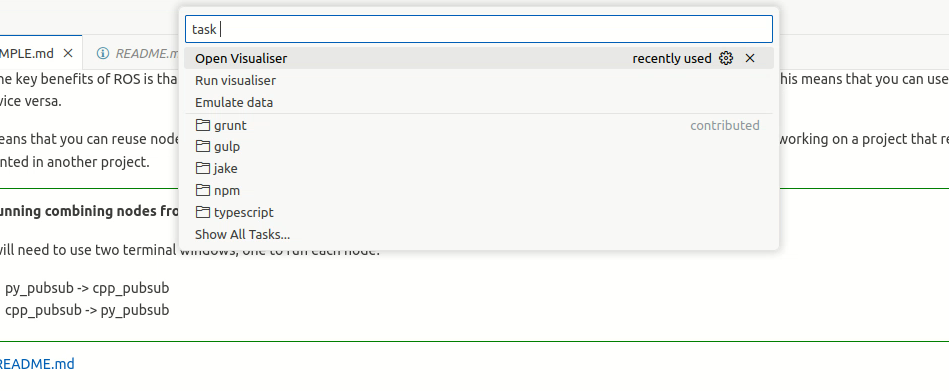

[Back to README.md](../README.md)

# Sensor activity

Make sure that you are in the cloud_ws directory, have built the workspace and sourced it.

The cloud_ws workspace contains two packages, py_cloud_filter and cpp_cloud_filter.
These are Python and C++ versions of point cloud processing nodes.

Pick your preferred language and examine the code for the publisher node.

- Python: [cloud_ws/src/py_cloud_filter/py_cloud_filter/filter.py](../cloud_ws/src/py_cloud_filter/py_cloud_filter/filter.py)
- C++: [cloud_ws/src/cpp_cloud_filter/src/filter.cpp](../cloud_ws/src/cpp_cloud_filter/src/filter.cpp)

Node of these nodes are set to receive information from a point cloud source (e.g. lidar) as a sensor_msgs/PointCloud2 message.
The node processes the point cloud data and publishes the result back to be used by later steps in the processing pipeline.

## Simulated data

In this example we are not using a real sensor to provide the point cloud data.
Instead we are going to use some simulated data that we created earlier.

Storing topics for later replay is a common technique in ROS development using ROS bags but we are not going to look at this in depth at this time.

For the purposes of this activity type `task Emulate data` into the command palette at the top of the page to automatically download and play the recorded data on a loop.




## Run node

Run the publisher node by running one of the following commands.

```bash
ros2 run py_cloud_filter filter
```

```bash
ros2 run cpp_cloud_filter filter
```

Using the various ROS commands we explained earlier you should be able to examine the nodes and topics that are running.

<div style="border: 4px solid green; padding: 10px; margin: 10px;">

**Why is the filter node not receiving any data?**

<details>
    <summary>Answer</summary>

At the moment the node is not receiving any data because it is not subscribed to a topic that has any data.
Unless you have personally hard coded the correct topic names into your code, in a real ROS system it is unlikely the nodes will be subscribing to the correct topic names by default.
This is especially true if you are using ROS packages provided by other developers.

In this case our filter node is subscribing to *~/input* topic but the data is being published to the */vehicle/velodyne/point_cloud* topic.
</details>

</div>


## Remapping 

Remapping allows you to change the topic name that a node is subscribing to when you run the node.
This is done by adding the `--remap` argument to the `ros2 run` command.

<div style="border: 4px solid green; padding: 10px; margin: 10px;">

**Remap the filter node to subscribe to the correct topic.**

You will need to use the `ros2 node info` command or look at the node source code to find the topic name that the node is subscribing to by default.

Use the `ros2 run` command to run the node with the correct topic name.

```bash
ros2 run py_cloud_filter filter --ros-args --remap /current/topic:=/correct/topic
```

```bash
ros2 run cpp_cloud_filter filter --ros-args --remap /current/topic:=/correct/topic
```

<details>
    <summary>Answer</summary>

```bash
ros2 run py_cloud_filter filter --ros-args --remap /py_filter/input:=/vehicle/velodyne/point_cloud
```

```bash
ros2 run cpp_cloud_filter filter --ros-args --remap /cpp_filter/input:=/vehicle/velodyne/point_cloud
```
</details>
</div>


## Viewing the data

Because ROS is a modular system there are a range of different visualisation tools with varying levels of complexity and capability. 
We are not going to look at these in depth at this time and instead use a simple browser based visualiser called rosboard.

Type `task Run visualiser` into the command palette at the top of the page to start the visualiser.

Then open the visualiser by typing `task Open visualiser` into the command palette at the top of the page.


## Editing the node

<div style="border: 4px solid green; padding: 10px; margin: 10px;">

As we can see from the visualisation, the point cloud data contains the ego vehicle.
There a range of data uses such as localisation and mapping where were would not want the ego vehicle to appear in the data as it will cause issues.

**Modify the node to remove the ego vehicle from the cloud and republish the cloud**

Make sure to check your changes by viewing them in the visualiser. 
You will need to add your output topic to the visualiser page by clicking on the ≡ icon.


<details>
    <summary>Py Solutions</summary>

Simple python solution.
```python
out_cloud = []
for x, y, z in numpy_cloud:
    if x < -2.0 or x > 0.0 or y < -1.1 or y > 1.1:
        out_cloud.append([x, y, z])
```

Numpy solution
```python
out_cloud = numpy_cloud[
    (numpy_cloud[:, 0] >= 0.0) | (numpy_cloud[:, 0] <= -2.0) |
    (numpy_cloud[:, 1] >= 1.1) | (numpy_cloud[:, 1] <= -1.1)
]
```
</details>

<details>
    <summary>C++ Solutions</summary>

Simple C++ solution.
```cpp
pcl::PointCloud<pcl::PointXYZ> filtered_cloud;
for(const pcl::PointXYZ& point : pcl_cloud){
    if(point.x < -2.0 || point.x > 0.0 || point.y < -1.1 || point.y > 1.1){
        filtered_cloud.emplace_back(point);
    }
}
pcl_cloud = filtered_cloud;
```

Parallel C++ solution
```cpp
auto it = std::remove_if( std::execution::par,
        pcl_cloud.begin(), pcl_cloud.end(),
        []( const pcl::PointXYZ& point ) {
            return point.x > -2.0 && point.x < 0.0 &&
                    point.y > -1.1 && point.y < 1.1;
        });
pcl_cloud.erase( it, pcl_cloud.end() );
```
</details>
</div>


[Back to README.md](../README.md)